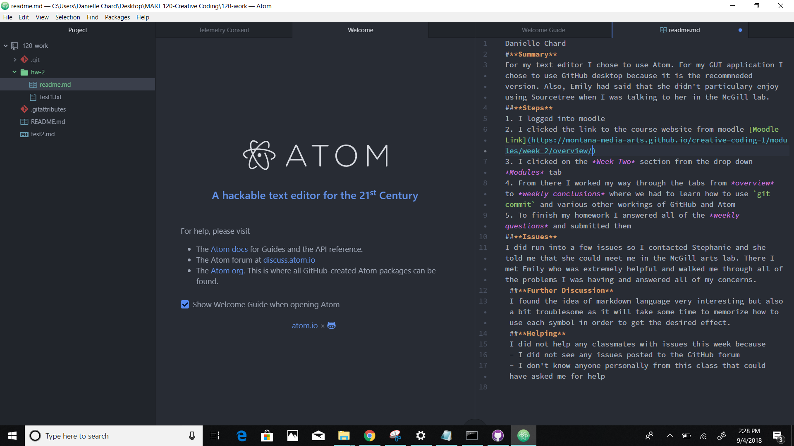

Danielle Chard
#**Summary**
For my text editor I chose to use Atom. For my GUI application I chose to use GitHub desktop because it is the recommneded version. Also, Emily had said that she didn't particulary enjoy using Sourcetree when I was talking to her in the McGill lab.
##**Steps**
1. I logged into moodle.
2. I clicked the link to the course website from moodle [Moodle Link](https://montana-media-arts.github.io/creative-coding-1/modules/week-2/overview/).
3. I clicked on the *Week Two* section from the drop down *Modules* tab.
4. From there I worked my way through the tabs from *overview* to *weekly conclusions* where we had to learn how to use `git commit` and various other workings of GitHub and Atom.
5. To finish my homework I answered all of the *weekly questions* and submitted them.
##**Issues**
I did run into a few issues so I contacted Stephanie and she told me that she could meet me in the McGill arts lab. There I met Emily who was extremely helpful and walked me through all of the problems I was having and answered all of my concerns.
 ##**Further Discussion**
 I found the idea of markdown language very interesting but also a bit troublesome as it will take some time to memorize how to use each symbol in order to get the desired effect.
 ##**Helping**
 I did not help any classmates with issues this week because
 - I did not see any issues posted to the GitHub forum
 - I don't know anyone personally from this class that could have asked me for help.
 ##**Insterting Photos*
 
